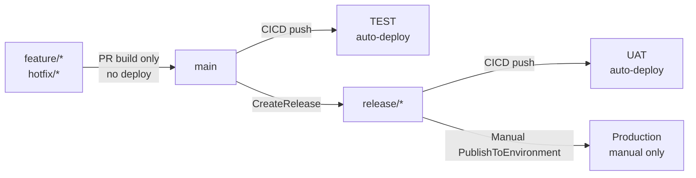
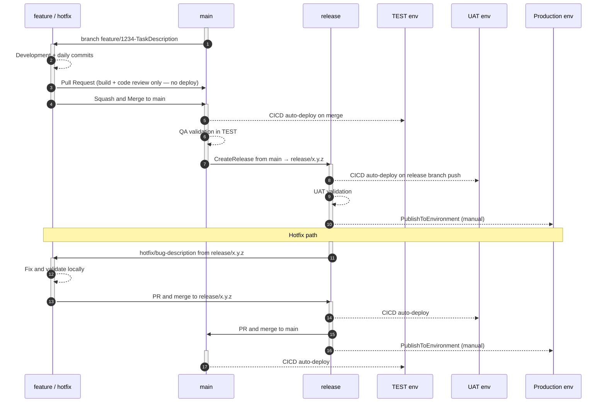

# AL-Go Standard Deployment Strategy

## Overview

This guide extends the [AL-Go Git Flow branching strategy](./BranchFlow.md) with a straightforward three-environment deployment model using flat AL-Go settings — no `ConditionalSettings` required.

| Environment | Trigger | Who deploys |
| --- | --- | --- |
| **TEST** | Push to `main` | Automatic |
| **UAT** | Push to `release/*` | Automatic |
| **Production** | Manual trigger from `release/*` | Technical Architect / DevOps / Release Manager |

The key insight: feature branches **build and validate but do not deploy**. Code reaches TEST only after it has been reviewed and merged to `main`. This is simpler to configure, easier to troubleshoot, and appropriate for teams where individual features are delivered sequentially or where pre-merge environment access is not required.

---

## When to Use This Model vs. the Three-Environment ConditionalSettings Model

| Factor | **This model** (standard) | [Three-environment ConditionalSettings](./ALGo-ThreeEnvironment-DeploymentStrategy.md) |
| --- | --- | --- |
| Pre-merge QA required | Not needed | Required |
| Concurrent parallel features | Sequential / few | Many |
| GitHub plan | Free or paid | Paid or public repo |
| Config complexity | Low — flat JSON | High — nested ConditionalSettings |
| `excludeEnvironments` needed | No | Yes |
| Silent failure risk | Lower | `EnvironmentCount=0` silent success on wrong branch |
| Branch naming convention | Not enforced by CICD | `feature/*` / `hotfix/*` required |

**Choose this model when** the team merges one feature at a time, QA validates after merge rather than before, or when simplicity and low operational risk outweigh the value of pre-merge environment isolation.

**Choose the ConditionalSettings model when** multiple developers push concurrent features, QA must sign off on each feature before it touches `main`, and the team is on a paid or public GitHub org.

---

## Branch → Environment Routing



---

## Full Development Lifecycle



---

## AL-Go Settings Configuration

The following `AL-Go-Settings.json` implements the branch-gated routing above using a flat `DeployTo<env>` structure. No `ConditionalSettings` or `excludeEnvironments` is required.

```json
{
  "$schema": "https://raw.githubusercontent.com/microsoft/AL-Go-Actions/v9.0/.Modules/settings.schema.json",
  "type": "PTE",
  "templateUrl": "https://github.com/microsoft/AL-Go-PTE@main",
  "runs-on": "self-hosted",
  "githubRunner": "self-hosted",
  "useCompilerFolder": true,
  "doNotPublishApps": false,
  "enablePerTenantExtensionCop": true,
  "versioningStrategy": 3,
  "CICDPushBranches": ["main", "release/*"],
  "CICDPullRequestBranches": ["main"],
  "<Test-Env>_AuthContextSecretName": "YOUR_TEST_AUTHCONTEXT",
  "<UAT-Env>_AuthContextSecretName": "YOUR_UAT_AUTHCONTEXT",
  "Production_AuthContextSecretName": "YOUR_PRODUCTION_AUTHCONTEXT",
  "DeployTo<Test-Env>": {
    "EnvironmentType": "SaaS",
    "EnvironmentName": "<Test-Env>",
    "Branches": ["main"],
    "ContinuousDeployment": true,
    "DependencyInstallMode": "install",
    "SyncMode": "Add"
  },
  "DeployTo<UAT-Env>": {
    "EnvironmentType": "SaaS",
    "EnvironmentName": "<UAT-Env>",
    "Branches": ["release/*"],
    "ContinuousDeployment": true,
    "DependencyInstallMode": "install",
    "SyncMode": "Add"
  },
  "DeployToProduction": {
    "EnvironmentType": "SaaS",
    "EnvironmentName": "Production",
    "Branches": ["release/*"],
    "ContinuousDeployment": false,
    "DependencyInstallMode": "install",
    "SyncMode": "Add"
  }
}
```

**Substitution guide** — replace these placeholders before use:

| Placeholder | Example value | Description |
| --- | --- | --- |
| `<Test-Env>` | `MyProject-Test` | Name of the GitHub Environment for TEST (must match exactly) |
| `<UAT-Env>` | `MyProject-UAT` | Name of the GitHub Environment for UAT |
| `YOUR_TEST_AUTHCONTEXT` | `MYPROJECT_TEST_AUTHCONTEXT` | Secret name holding the TEST BC auth context |
| `YOUR_UAT_AUTHCONTEXT` | `MYPROJECT_UAT_AUTHCONTEXT` | Secret name holding the UAT BC auth context |
| `YOUR_PRODUCTION_AUTHCONTEXT` | `MYPROJECT_PRODUCTION_AUTHCONTEXT` | Secret name holding the Production BC auth context |

Also replace `self-hosted` with `windows-latest` / `ubuntu-latest` if using GitHub-hosted runners.

> **Why no `ConditionalSettings`?** The `Branches` key inside each `DeployTo<env>` block is sufficient to gate routing when all `DeployTo` blocks are always present. `ConditionalSettings` is only needed when a `DeployTo` block must appear for some branches and be completely absent for others (which triggers registered GitHub Environments to fill in with default behavior, requiring `excludeEnvironments` to suppress them).

---

## Required GitHub Setup

### 1. GitHub Environments

Create three GitHub Environments in your repository (Settings → Environments):

| Environment | Required secret | Branch gating |
| --- | --- | --- |
| `<Test-Env>` | `YOUR_TEST_AUTHCONTEXT` | No GitHub-level policy required — `Branches: ["main"]` in settings handles it |
| `<UAT-Env>` | `YOUR_UAT_AUTHCONTEXT` | No GitHub-level policy required — `Branches: ["release/*"]` in settings handles it |
| `Production` | `YOUR_PRODUCTION_AUTHCONTEXT` | Recommended: add reviewer approval rule in GitHub Environment |

> **Free GitHub org (private repo):** GitHub Environments are unavailable on private repos under the free plan. In that case, use the `environments: [...]` array in settings instead of registering GitHub Environments. Replace the three `DeployTo<env>` blocks above with an `"environments": ["<Test-Env>", "<UAT-Env>", "Production"]` array and configure each environment's auth context at repo-secret level. Note: the `environments` array does not support per-environment `Branches` gating — all listed environments deploy on every CICD run. Use `CICDPushBranches` to limit which branches trigger CICD at all.

### 2. Auth context secrets

For each environment, create the auth context secret using one of two approaches:

- **Environment-level secret** (recommended): Settings → Environments → `<env-name>` → Add secret. Scoped to jobs deploying to that specific environment.
- **Repository-level secret**: Settings → Secrets and variables → Actions → New repository secret. Available to all jobs. Simpler setup; acceptable when environment-level is unavailable.

See [AUTHCONTEXT.md](./AUTHCONTEXT.md) for the secret generation steps. Rotate every 90 days.

---

## Deployment Procedures

### Standard feature release

```text
feature/* → PR → main → CICD → TEST auto-deploys
                       ↓
                QA validates in TEST
                       ↓
                CreateRelease (from main → release/x.y.z)
                       ↓
                CICD on release/x.y.z → UAT auto-deploys
                       ↓
                PublishToEnvironment (from release/x.y.z → Production)
```

**Commands:**

```powershell
# 1. Merge feature PR to main via GitHub UI (squash and merge)
# 2. Wait for CICD on main to complete (TEST auto-deploys)
# 3. QA validates in TEST

# 4. Create the GitHub Release from main (creates release/x.y.z branch)
gh workflow run CreateRelease.yaml --ref main --field buildVersion=latest --field createReleaseBranch=true

# 5. Wait for CICD on release/x.y.z to complete (UAT auto-deploys)
# 6. UAT validation

# 7. Publish to Production from the release branch
gh workflow run PublishToEnvironment.yaml --ref release/x.y.z --field appVersion=latest --field environmentName=Production
```

> **Same-branch rule**: `CreateRelease` and `PublishToEnvironment` must run from the **same branch**. Artifact names are built with the branch ref at CICD time — mixing branches causes a silent asset name mismatch and zero apps deployed.
>
> In this model, `CreateRelease` runs from `main` (to create the release branch), and the CICD that builds the release artifacts runs on `release/x.y.z`. Therefore `PublishToEnvironment` must also run from `release/x.y.z` — not from `main`.

### Hotfix release

```text
hotfix/* (from release/x.y.z) → PR → release/x.y.z → CICD → UAT
PR → main → CICD → TEST
PublishToEnvironment from release/x.y.z → Production
```

**Commands:**

```powershell
# 1. Create hotfix branch from the active release branch
git checkout -b hotfix/fix-description origin/release/x.y.z
# ... make the fix ...
git add -A && git commit -m "Hotfix: fix-description"
git push origin hotfix/fix-description
# PR build fires — build only, no deploy (hotfix/* is not in CICDPushBranches)

# 2. Merge hotfix to release branch
gh pr create --base release/x.y.z --head hotfix/fix-description --title "Hotfix: fix-description"
# After merge: CICD on release/x.y.z → UAT auto-deploys. Validate in UAT.

# 3. Merge hotfix to main (keep main current with the fix)
gh pr create --base main --head hotfix/fix-description --title "Hotfix: fix-description (main sync)"
# After merge: CICD on main → TEST auto-deploys

# 4. Publish to Production from the release branch (same-branch rule)
gh workflow run PublishToEnvironment.yaml --ref release/x.y.z --field appVersion=latest --field environmentName=Production
```

---

## Rules — Do Not Violate

| Rule | If broken |
| --- | --- |
| `doNotPublishApps: false` | Artifacts never uploaded → all deploy jobs silently skip with no error |
| `Branches` key required inside every `DeployTo<env>` block | Missing = empty allowlist = environment excluded from CICD matrix even with `ContinuousDeployment: true` |
| `CICDPushBranches` must NOT include `feature/*` or `hotfix/*` | Feature pushes trigger CICD, and since no `DeployTo` block has `feature/*` in its `Branches`, all environments appear in the matrix with `EnvironmentCount=0` — wasted runner time |
| `CreateRelease` with `createReleaseBranch: true` | Without the release branch, CICD on `release/*` never fires — UAT never auto-deploys |
| `PublishToEnvironment` from the same branch as the most recent CICD run | Asset names mismatch → `PublishToEnvironment` finds 0 artifacts, reports "success", nothing deployed |
| At least one non-markdown, non-workflow file change per push | `paths-ignore` in CICD.yaml skips the run → CICD never triggers |
| Run CICD on the release branch before `PublishToEnvironment` | `shortLivedArtifactsRetentionDays: 1` — expired artifacts → deploy finds nothing |

---

## Validation Test Suite

Before applying this configuration to a production repository, verify all scenarios below pass:

| Test | Trigger | Expected outcome |
| --- | --- | --- |
| T01 | Push to `main` | CICD: `Environments found: <Test-Env>`, `EnvironmentCount=1`, Deploy to TEST runs |
| T02 | Push to `release/*` | CICD: `Environments found: <UAT-Env>, Production`, `EnvironmentCount=1`, Deploy to UAT runs. TEST absent. |
| T03 | Open PR from `feature/*` → `main` | Workflow: `Pull Request Build` fires, **zero** `Deploy to` jobs |
| T04 | `PublishToEnvironment` from `main` → Production | `EnvironmentCount=0`, Deploy skipped — Production `Branches` is `["release/*"]`, not `main` |
| T05 | `PublishToEnvironment` from `release/x.y.z` → Production | `EnvironmentCount=1`, Deploy to Production succeeds |

> **How to verify routing**: Open the `Initialization` job in any CICD run and check for `Environments found: ...` and `EnvironmentCount=N`.

---

## Key Differences from the Three-Environment ConditionalSettings Model

| Aspect | This guide (standard) | [Three-environment ConditionalSettings](./ALGo-ThreeEnvironment-DeploymentStrategy.md) |
| --- | --- | --- |
| TEST deploy source | `main` (post-merge) | `feature/*`, `hotfix/*` (pre-merge) |
| When developer sees TEST | After PR merged to main | Immediately on push to feature branch |
| UAT deploy source | `release/*` | `main` and `release/*` |
| Settings structure | Flat `DeployTo` blocks | Nested `ConditionalSettings` |
| `excludeEnvironments` needed | No | Yes |
| Branch naming enforced | No | Yes (`feature/*`, `hotfix/*` required) |
| Silent EnvironmentCount=0 risk | Lower | Present — must check Initialization log |
| GitHub Environments required | Yes (or `environments` array for free orgs) | Yes (paid / public) |
| Configuration complexity | Low | High |
| Suitable when | Sequential delivery, small team, QA post-merge | Parallel features, QA pre-merge required |
