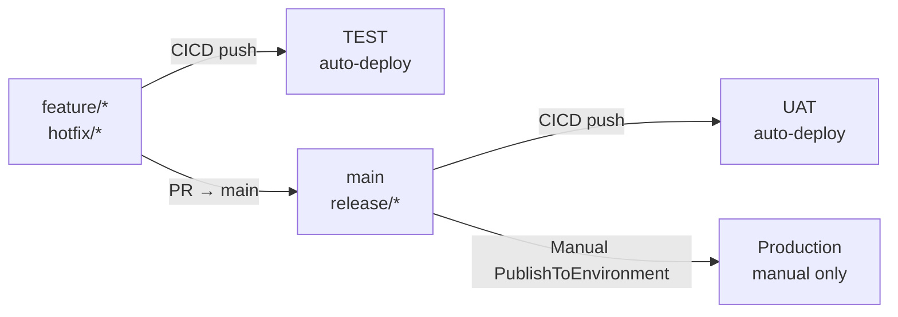
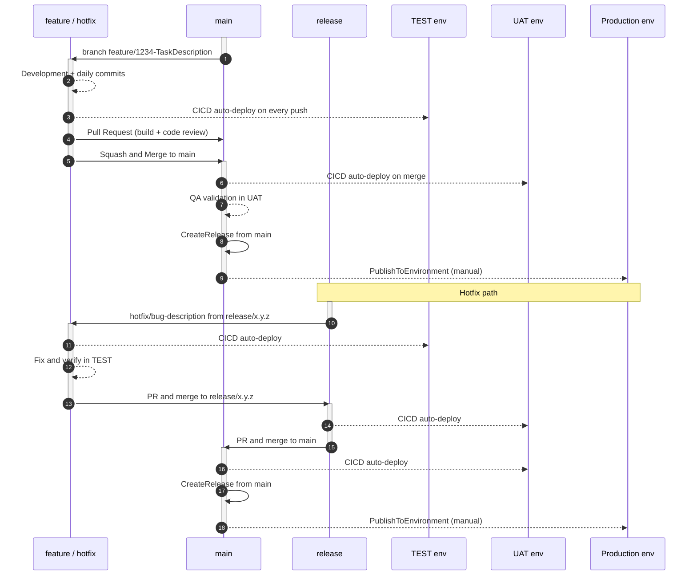

# AL-Go Three-Environment Deployment Strategy

## Overview

This guide extends the [AL-Go Git Flow branching strategy](./BranchFlow.md) with a validated three-environment deployment model using AL-Go for GitHub v9.0 `ConditionalSettings`. It replaces the generic "TEST Environment" concept from the base guide with a precise, branch-gated three-tier model:

| Environment | Trigger | Who deploys |
| --- | --- | --- |
| **TEST** | Push to `feature/*` or `hotfix/*` | Automatic |
| **UAT** | Push to `main` or `release/*` | Automatic |
| **Production** | Manual trigger from `main` or `release/*` | Technical Architect / DevOps / Release Manager |

The key insight: TEST gets code **before** it merges to `main`, so QA sees the candidate in isolation. UAT gets code **after** merge, so it always reflects the integrated state. Production only gets code when someone consciously decides to ship — always triggered manually, from either `main` or an active `release/*` branch.

---

## Branch → Environment Routing



---

## Full Development Lifecycle



---

## AL-Go Settings Configuration

The following `AL-Go-Settings.json` configuration implements the branch-gated routing above using `ConditionalSettings`. This is the validated pattern — do not modify the structure without re-running the full test suite.

```json
{
  "$schema": "https://raw.githubusercontent.com/microsoft/AL-Go-Actions/v9.0/.Modules/settings.schema.json",
  "type": "PTE",
  "templateUrl": "https://github.com/microsoft/AL-Go-PTE@main",
  "runs-on": "self-hosted",
  "githubRunner": "self-hosted",
  "useCompilerFolder": true,
  "doNotPublishApps": false,
  "enablePerTenantExtensionCop": true,
  "versioningStrategy": 3,
  "CICDPushBranches": ["main", "release/*", "feature/*", "hotfix/*"],
  "<Test-Env>_AuthContextSecretName": "YOUR_TEST_AUTHCONTEXT",
  "<UAT-Env>_AuthContextSecretName": "YOUR_UAT_AUTHCONTEXT",
  "Production_AuthContextSecretName": "YOUR_PRODUCTION_AUTHCONTEXT",
  "ConditionalSettings": [
    {
      "branches": ["feature/*", "hotfix/*"],
      "settings": {
        "DeployTo<Test-Env>": {
          "EnvironmentType": "SaaS",
          "EnvironmentName": "<Test-Env>",
          "Branches": ["feature/*", "hotfix/*"],
          "ContinuousDeployment": true,
          "DependencyInstallMode": "install",
          "SyncMode": "Add"
        }
      }
    },
    {
      "branches": ["main", "release/*"],
      "settings": {
        "excludeEnvironments": ["<Test-Env>"],
        "DeployTo<UAT-Env>": {
          "EnvironmentType": "SaaS",
          "EnvironmentName": "<UAT-Env>",
          "Branches": ["main", "release/*"],
          "ContinuousDeployment": true,
          "DependencyInstallMode": "install",
          "SyncMode": "Add"
        },
        "DeployToProduction": {
          "EnvironmentType": "SaaS",
          "EnvironmentName": "Production",
          "Branches": ["main", "release/*"],
          "ContinuousDeployment": false,
          "DependencyInstallMode": "install",
          "SyncMode": "Add"
        }
      }
    }
  ]
}
```

**Substitution guide** — replace these placeholders before use:

| Placeholder | Example value | Description |
| --- | --- | --- |
| `<Test-Env>` | `MyProject-Test` | Name of the GitHub Environment for TEST (must match exactly) |
| `<UAT-Env>` | `MyProject-UAT` | Name of the GitHub Environment for UAT |
| `YOUR_TEST_AUTHCONTEXT` | `MYPROJECT_TEST_AUTHCONTEXT` | Secret name holding the TEST BC auth context |
| `YOUR_UAT_AUTHCONTEXT` | `MYPROJECT_UAT_AUTHCONTEXT` | Secret name holding the UAT BC auth context |
| `YOUR_PRODUCTION_AUTHCONTEXT` | `MYPROJECT_PRODUCTION_AUTHCONTEXT` | Secret name holding the Production BC auth context |

Also replace `self-hosted` with `windows-latest` / `ubuntu-latest` if using GitHub-hosted runners.

---

## Required GitHub Setup

### 1. GitHub Environments

Create three GitHub Environments in your repository (Settings → Environments):

| Environment | Required secret | Branch gating |
| --- | --- | --- |
| `<Test-Env>` | `YOUR_TEST_AUTHCONTEXT` | No GitHub-level policy required — controlled by `Branches` in settings |
| `<UAT-Env>` | `YOUR_UAT_AUTHCONTEXT` | No GitHub-level policy required |
| `Production` | `YOUR_PRODUCTION_AUTHCONTEXT` | Recommended: add reviewer approval rule in GitHub Environment |

> The `Branches` key inside each `DeployTo<env>` block is the gating mechanism. GitHub Environment branch policies are optional additional protection.

### 2. Auth context secrets

For each environment, create the auth context secret using one of two approaches:

- **Environment-level secret** (recommended): Settings → Environments → `<env-name>` → Add secret. Scoped to jobs deploying to that specific environment — better security isolation.
- **Repository-level secret**: Settings → Secrets and variables → Actions → New repository secret. Available to all jobs. Simpler setup; use if environment-level is not required.

AL-Go resolves the secret by name regardless of level — both approaches work. See [AUTHCONTEXT.md](./AUTHCONTEXT.md) for the secret generation steps (that guide shows repository-level creation). Rotate every 90 days.

---

## Deployment Procedures

### Standard feature release

```text
feature/* → PR → main → CICD → UAT auto-deploys
                       ↓
                CreateRelease (from main)
                       ↓
                PublishToEnvironment (from main → Production)
```

> **Same-branch rule applies here too**: both `CreateRelease` and `PublishToEnvironment` run from `main`. For hotfixes you can run both from `release/x.y.z` instead — see the hotfix section below.

**Commands:**

```powershell
# 1. Merge feature PR to main via GitHub UI (squash and merge)
# 2. Wait for CICD on main to complete (UAT auto-deploys)

# 3. Create the GitHub Release from main
gh workflow run CreateRelease.yaml --ref main --field buildVersion=latest --field createReleaseBranch=false

# 4. After release succeeds, publish to Production
gh workflow run PublishToEnvironment.yaml --ref main --field appVersion=latest --field environmentName=Production
```

> **Same-branch rule**: `CreateRelease` and `PublishToEnvironment` must run from the **same branch**. Artifact names are built with the branch ref at CICD time — mixing branches causes a silent asset name mismatch and zero apps deployed.

### Hotfix release

```text
hotfix/* (from release/x.y.z) → CICD → TEST
PR → release/x.y.z → CICD → UAT
PR → main → CICD → UAT
CreateRelease (from main) → PublishToEnvironment (from main → Production)
```

**Commands:**

```powershell
# 1. Create hotfix branch from the active release branch
git checkout -b hotfix/fix-description origin/release/x.y.z
# ... make the fix ...
git add -A && git commit -m "Hotfix: fix-description"
# Include at least one non-markdown file change to trigger CICD
git push origin hotfix/fix-description
# CICD fires on hotfix/* → TEST auto-deploys. Verify fix.

# 2. Merge hotfix to release branch
gh pr create --base release/x.y.z --head hotfix/fix-description --title "Hotfix: fix-description"
# After merge: CICD on release/x.y.z → UAT auto-deploys

# 3. Merge release to main (keep main current with the fix)
gh pr create --base main --head release/x.y.z --title "Merge release/x.y.z to main"
# After merge: CICD on main → UAT re-deploys

# 4. Release and deploy to Production (both from main)
gh workflow run CreateRelease.yaml --ref main --field buildVersion=latest --field createReleaseBranch=false
gh workflow run PublishToEnvironment.yaml --ref main --field appVersion=latest --field environmentName=Production
```

---

## Rules — Do Not Violate

These rules were discovered through systematic testing and each one has a documented failure mode if broken.

| Rule | If broken |
| --- | --- |
| `doNotPublishApps: false` | Artifacts never uploaded → all deploy jobs silently skip with no error |
| Do not mix `environments: [...]` array with registered GitHub Environments | The `environments` array is the correct mechanism for free GitHub orgs where GitHub Environments are unavailable (private repos on free plans). If GitHub Environments **are** registered in Settings → Environments, do not also add the `environments` array — AL-Go will merge both lists and ConditionalSettings branch gating is bypassed for the array-defined entries |
| `Branches` key required inside every `DeployTo<env>` block | Missing = empty allowlist = environment excluded from CICD matrix even with `ContinuousDeployment: true` |
| `excludeEnvironments: ["<Test-Env>"]` in the main/release block | TEST environment re-deploys on every main push (from the registered GitHub Environment) |
| `CreateRelease` and `PublishToEnvironment` from the same branch | Asset names mismatch → `PublishToEnvironment` finds 0 artifacts, reports "success", nothing deployed |
| At least one non-markdown, non-workflow file change per push | `paths-ignore` in CICD.yaml skips the run → CICD never triggers |
| Run CICD on main before `PublishToEnvironment` | `shortLivedArtifactsRetentionDays: 1` — expired artifacts → deploy finds nothing |

---

## Validation Test Suite

Before applying this configuration to a production repository, verify all scenarios below pass:

| Test | Trigger | Expected outcome |
| --- | --- | --- |
| T01 | Push to `feature/*` | CICD: `Environments found: <Test-Env>`, `EnvironmentCount=1`, Deploy to TEST runs |
| T02 | Push to `hotfix/*` | CICD: same as T01 — TEST auto-deploys |
| T03 | Push to `main` | CICD: `Environments found: <UAT-Env>, Production`, `EnvironmentCount=1`, Deploy to UAT runs. TEST absent. |
| T04 | Push to `release/*` | CICD: same as T03 — UAT auto-deploys, TEST absent |
| T05 | Open PR from `feature/*` → `main` | Workflow: `Pull Request Build` fires, **zero** `Deploy to` jobs |
| T06 | `PublishToEnvironment` from `feature/*` → Production | `EnvironmentCount=0`, Deploy skipped, log: "not setup for deployments from branch feature/..." |
| T07 | `PublishToEnvironment` from `main` → Production | `EnvironmentCount=1`, Deploy to Production succeeds |

> **How to verify routing**: Open the `Initialization` job in any CICD run and check for `Environments found: ...` and `EnvironmentCount=N`. This is the authoritative routing evidence — it shows exactly which environments are in the deploy matrix and why.
>
> **On wrong-branch publish (T06)**: AL-Go reports overall workflow "success" even when `EnvironmentCount=0`. The deploy is silently skipped. Always check `EnvironmentCount` in the Initialization log when you suspect a wrong-branch publish.

---

## Key Differences from the Base BranchFlow.md

The base [BranchFlow.md](./BranchFlow.md) describes TEST as deploying from `main`. This three-environment model moves TEST earlier in the pipeline:

| Aspect | BranchFlow.md (base) | This guide (three-environment) |
| --- | --- | --- |
| TEST deploy source | `main` (post-merge) | `feature/*`, `hotfix/*` (pre-merge) |
| When developer sees TEST | After PR merged to main | Immediately on push to feature branch |
| UAT | Not explicit | `main` and `release/*` auto-deploy |
| Production | Implied post-release | Manual `PublishToEnvironment` from `main` |

Moving TEST to feature branches means QA can validate a candidate in isolation before it affects the integrated main codebase. UAT then always reflects what is already in `main` — stable, reviewed, merged code.
