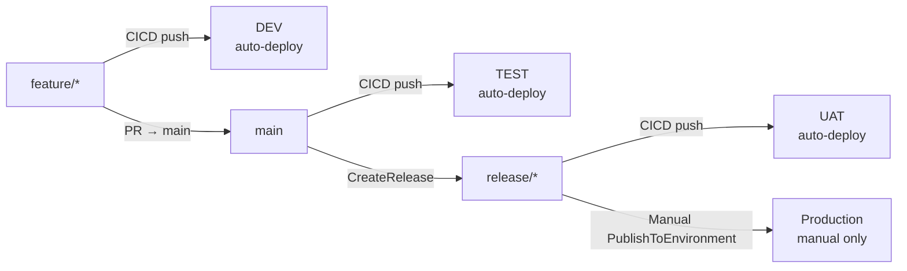
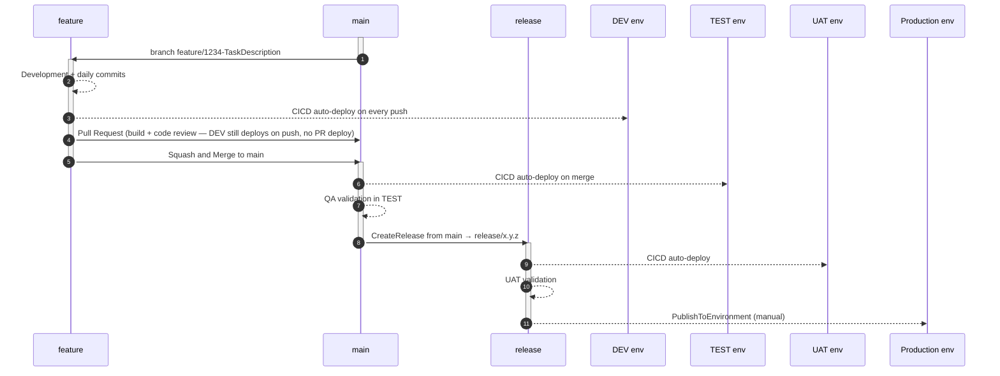

# AL-Go Four-Environment Deployment Strategy (Flat Settings + Dev)

## Overview

This guide extends the [AL-Go Standard Deployment Strategy](./ALGo-StandardDeployment.md) by adding a dedicated **DEV environment** that auto-deploys on every push to a `feature/*` branch. It uses the same flat `DeployTo<env>` structure — no `ConditionalSettings` required.

| Environment | Trigger | Who deploys |
| --- | --- | --- |
| **DEV** | Push to `feature/*` | Automatic |
| **TEST** | Push to `main` | Automatic |
| **UAT** | Push to `release/*` | Automatic |
| **Production** | Manual trigger from `release/*` | Technical Architect / DevOps / Release Manager |

The key difference from the [three-environment ConditionalSettings model](./ALGo-ThreeEnvironment-DeploymentStrategy.md): DEV and TEST are **separate environments**, so TEST always reflects stable, merged code from `main` — never a work-in-progress feature branch. Developers can verify their feature in DEV before raising a PR, while TEST remains a clean integration signal.

Hotfixes follow the same convention as in the standard model — they are `feature/*` branches (e.g., `feature/hotfix-<description>-from-<release>`), so they also auto-deploy to DEV.

---

## When to Use This Model

| Factor | **This model** | [Standard (3-env)](./ALGo-StandardDeployment.md) | [ConditionalSettings (3-env)](./ALGo-ThreeEnvironment-DeploymentStrategy.md) |
| --- | --- | --- | --- |
| Pre-merge feature env needed | Yes — DEV | No | Yes — TEST used as pre-merge env |
| TEST always reflects integrated code | Yes | Yes | No — TEST is the pre-merge env |
| Settings complexity | Low — flat JSON | Low — flat JSON | High — nested ConditionalSettings |
| `excludeEnvironments` needed | No | No | Yes |
| Number of BC environments | 4 | 3 | 3 |
| GitHub plan | Paid or public | Free or paid | Paid or public |
| Branch naming enforced by CICD | Yes (`feature/*` required) | No | Yes (`feature/*` required) |

**Choose this model when** developers need an environment to verify their feature before raising a PR, AND you want TEST to remain a stable post-merge signal that is never overwritten by in-progress work.

---

## Branch → Environment Routing



---

## Full Development Lifecycle



---

## AL-Go Settings Configuration

The flat structure extends the standard model: `feature/*` is added to `CICDPushBranches` and a `DeployTo<Dev-Env>` block is added. No `ConditionalSettings` or `excludeEnvironments` is needed — the `Branches` key inside each `DeployTo` block is always present and gates routing correctly.

```json
{
  "$schema": "https://raw.githubusercontent.com/microsoft/AL-Go-Actions/v9.0/.Modules/settings.schema.json",
  "type": "PTE",
  "templateUrl": "https://github.com/microsoft/AL-Go-PTE@main",
  "runs-on": "self-hosted",
  "githubRunner": "self-hosted",
  "useCompilerFolder": true,
  "doNotPublishApps": false,
  "enablePerTenantExtensionCop": true,
  "versioningStrategy": 3,
  "CICDPushBranches": ["main", "release/*", "feature/*"],
  "CICDPullRequestBranches": ["main"],
  "<Dev-Env>_AuthContextSecretName": "YOUR_DEV_AUTHCONTEXT",
  "<Test-Env>_AuthContextSecretName": "YOUR_TEST_AUTHCONTEXT",
  "<UAT-Env>_AuthContextSecretName": "YOUR_UAT_AUTHCONTEXT",
  "Production_AuthContextSecretName": "YOUR_PRODUCTION_AUTHCONTEXT",
  "DeployTo<Dev-Env>": {
    "EnvironmentType": "SaaS",
    "EnvironmentName": "<Dev-Env>",
    "Branches": ["feature/*"],
    "ContinuousDeployment": true,
    "DependencyInstallMode": "install",
    "SyncMode": "Add"
  },
  "DeployTo<Test-Env>": {
    "EnvironmentType": "SaaS",
    "EnvironmentName": "<Test-Env>",
    "Branches": ["main"],
    "ContinuousDeployment": true,
    "DependencyInstallMode": "install",
    "SyncMode": "Add"
  },
  "DeployTo<UAT-Env>": {
    "EnvironmentType": "SaaS",
    "EnvironmentName": "<UAT-Env>",
    "Branches": ["release/*"],
    "ContinuousDeployment": true,
    "DependencyInstallMode": "install",
    "SyncMode": "Add"
  },
  "DeployToProduction": {
    "EnvironmentType": "SaaS",
    "EnvironmentName": "Production",
    "Branches": ["release/*"],
    "ContinuousDeployment": false,
    "DependencyInstallMode": "install",
    "SyncMode": "Add"
  }
}
```

**Substitution guide** — replace these placeholders before use:

| Placeholder | Example value | Description |
| --- | --- | --- |
| `<Dev-Env>` | `MyProject-Dev` | Name of the GitHub Environment for DEV (must match exactly) |
| `<Test-Env>` | `MyProject-Test` | Name of the GitHub Environment for TEST |
| `<UAT-Env>` | `MyProject-UAT` | Name of the GitHub Environment for UAT |
| `YOUR_DEV_AUTHCONTEXT` | `MYPROJECT_DEV_AUTHCONTEXT` | Secret name holding the DEV BC auth context |
| `YOUR_TEST_AUTHCONTEXT` | `MYPROJECT_TEST_AUTHCONTEXT` | Secret name holding the TEST BC auth context |
| `YOUR_UAT_AUTHCONTEXT` | `MYPROJECT_UAT_AUTHCONTEXT` | Secret name holding the UAT BC auth context |
| `YOUR_PRODUCTION_AUTHCONTEXT` | `MYPROJECT_PRODUCTION_AUTHCONTEXT` | Secret name holding the Production BC auth context |

Also replace `self-hosted` with `windows-latest` / `ubuntu-latest` if using GitHub-hosted runners.

> **Why no `ConditionalSettings` or `excludeEnvironments`?** In this flat model, every `DeployTo<env>` block is always present in the merged settings with an explicit `Branches` key. AL-Go checks the `Branches` allowlist before including an environment in the deploy matrix. If the current branch is not in the list, the environment is excluded. This differs from the `ConditionalSettings` model where a `DeployTo<env>` block may be entirely absent for some branches, causing AL-Go to fall back to GitHub Environment defaults — which is why `excludeEnvironments` is needed there.

---

## Required GitHub Setup

### 1. GitHub Environments

Create four GitHub Environments in your repository (Settings → Environments):

| Environment | Required secret | Branch gating |
| --- | --- | --- |
| `<Dev-Env>` | `YOUR_DEV_AUTHCONTEXT` | No GitHub-level policy required — `Branches: ["feature/*"]` in settings handles it |
| `<Test-Env>` | `YOUR_TEST_AUTHCONTEXT` | No GitHub-level policy required — `Branches: ["main"]` in settings handles it |
| `<UAT-Env>` | `YOUR_UAT_AUTHCONTEXT` | No GitHub-level policy required — `Branches: ["release/*"]` in settings handles it |
| `Production` | `YOUR_PRODUCTION_AUTHCONTEXT` | Recommended: add reviewer approval rule in GitHub Environment |

### 2. Auth context secrets

For each environment, create the auth context secret at environment-level (recommended) or repository-level. See [AUTHCONTEXT.md](./AUTHCONTEXT.md) for generation steps. Rotate every 90 days.

---

## Deployment Procedures

### Standard feature release

```text
feature/* → CICD → DEV auto-deploys (developer verification)
          → PR → main → CICD → TEST auto-deploys
                               ↓
                          QA validates in TEST
                               ↓
                          CreateRelease (from main → release/x.y.z)
                               ↓
                          CICD on release/x.y.z → UAT auto-deploys
                               ↓
                          PublishToEnvironment (from release/x.y.z → Production)
```

**Commands:**

```powershell
# 1. Develop on feature branch — DEV auto-deploys on every push
# 2. Raise PR to main → PR build fires (no deploy during PR)
# 3. Merge PR to main (squash and merge)
# 4. Wait for CICD on main to complete (TEST auto-deploys)
# 5. QA validates in TEST

# 6. Create the GitHub Release from main (creates release/x.y.z branch)
gh workflow run CreateRelease.yaml --ref main --field buildVersion=latest --field createReleaseBranch=true

# 7. Wait for CICD on release/x.y.z to complete (UAT auto-deploys)
# 8. UAT validation

# 9. Publish to Production from the release branch
gh workflow run PublishToEnvironment.yaml --ref release/x.y.z --field appVersion=latest --field environmentName=Production
```

> **Same-branch rule**: `CreateRelease` runs from `main` (creating `release/x.y.z`). CICD on `release/x.y.z` builds the release artifacts. `PublishToEnvironment` must also run from `release/x.y.z` — not from `main`.

### Hotfix (bug fix from a release branch)

Hotfixes use the same `feature/*` naming convention: `feature/hotfix-<description>-from-<release>`. Since `feature/*` is in `CICDPushBranches`, pushing to this branch auto-deploys to DEV.

```powershell
# 1. Create the fix branch from the active release branch
git checkout -b feature/hotfix-fix-description-from-x.y.z origin/release/x.y.z
# ... make the fix ...
git add -A && git commit -m "Hotfix: fix-description"
git push origin feature/hotfix-fix-description-from-x.y.z
# CICD fires → DEV auto-deploys. Verify fix in DEV.

# 2. Merge to release branch
gh pr create --base release/x.y.z --head feature/hotfix-fix-description-from-x.y.z --title "Hotfix: fix-description"
# After merge: CICD on release/x.y.z → UAT auto-deploys

# 3. Merge to main (keep main current with the fix)
gh pr create --base main --head feature/hotfix-fix-description-from-x.y.z --title "Hotfix: fix-description (main sync)"
# After merge: CICD on main → TEST auto-deploys

# 4. Publish to Production from the release branch
gh workflow run PublishToEnvironment.yaml --ref release/x.y.z --field appVersion=latest --field environmentName=Production
```

---

## Rules — Do Not Violate

| Rule | If broken |
| --- | --- |
| `doNotPublishApps: false` | Artifacts never uploaded → all deploy jobs silently skip with no error |
| `Branches` key required inside every `DeployTo<env>` block | Missing = empty allowlist = environment excluded from CICD matrix even with `ContinuousDeployment: true` |
| `feature/*` in `CICDPushBranches` | Feature branch pushes do not trigger CICD → DEV never deploys |
| Do not mix `environments: [...]` array with registered GitHub Environments | The `environments` array bypasses `Branches` gating — all listed environments deploy from all branches |
| `CreateRelease` with `createReleaseBranch: true` | Without the release branch, CICD on `release/*` never fires — UAT never auto-deploys |
| `PublishToEnvironment` from `release/x.y.z`, not from `main` | `PublishToEnvironment` looks for artifacts named `release_x.y.z-Apps-*` — running from `main` finds `main-Apps-*`, silently "succeeds" with zero apps deployed |
| At least one non-markdown, non-workflow file change per push | `paths-ignore` in CICD.yaml skips the run → CICD never triggers |

---

## Validation Test Suite

Before applying this configuration to a production repository, verify all scenarios below pass:

| Test | Trigger | Expected outcome |
| --- | --- | --- |
| T01 | Push to `feature/*` | CICD: `Environments found: <Dev-Env>`, `EnvironmentCount=1`, Deploy to DEV runs. TEST/UAT/Production absent. |
| T02 | Push to `main` | CICD: `Environments found: <Test-Env>`, `EnvironmentCount=1`, Deploy to TEST runs. DEV/UAT/Production absent. |
| T03 | Push to `release/*` | CICD: `Environments found: <UAT-Env>, Production`, `EnvironmentCount=1`, Deploy to UAT runs. DEV/TEST absent. |
| T04 | Open PR from `feature/*` → `main` | Workflow: `Pull Request Build` fires, **zero** `Deploy to` jobs |
| T05 | `PublishToEnvironment` from `main` → Production | `EnvironmentCount=0`, Deploy skipped — Production `Branches` is `["release/*"]`, not `main` |
| T06 | `PublishToEnvironment` from `release/x.y.z` → Production | `EnvironmentCount=1`, Deploy to Production succeeds |

> **How to verify routing**: Open the `Initialization` job in any CICD run and check `Environments found: ...` and `EnvironmentCount=N`.
>
> **Note**: This configuration has not been validated with a full end-to-end test suite equivalent to the [three-environment ConditionalSettings model](./ALGo-ThreeEnvironment-DeploymentStrategy.md). The routing logic follows the same AL-Go `Branches` gating principles, but a full T01–T06 validation run against live BC environments is recommended before production use.
