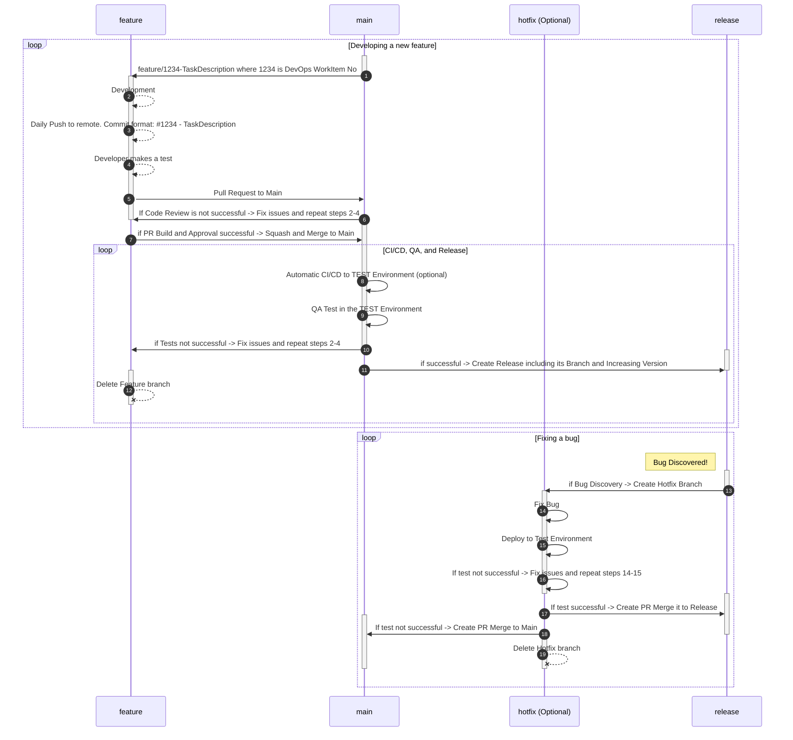

# AL-Go-Git Flow

## Branching Strategy

In Git Flow, a well-defined branching strategy helps manage the development process efficiently. The key branches in Git Flow are:

- **`main` branch:** Represents the latest code. All code changes should pass this branch.
- **`feature` branches:** Created for developing new features.
- **`release` branches:** Generated for a new release.
- **`hotfix` branches:** Created to fix critical issues in the released code.

## Flow Steps
> [!NOTE]  
> Numbers in the diagram and in the text below are not connected to each other. They are just for sequencing. 

1. **Create `feature` Branch:**
   - Create a `feature` branch from `main` with the name `feature/1234-TaskDescription`, where 1234 is the DevOps WorkItem number.

2. **Feature Development:**
   - Develop a new feature
   - Please use [Best Practices for AL development](https://github.com/ciellosinc/Ciellos-BC-git-flow-template/blob/main/Guides/ALDevelopmentBestPractices.md)
   - Commit changes with a comment like `AB#1234 - TaskDescription` indicating the related DevOps WorkItem.
       - Where AB# is the prefix to the Azure DevOps integration. If you are using another Product Backlog System, like Jira, Azure DevOps, or GitHub Projects.
       - Feel free to copy and paste the Task Title from the Product Backlog System. Feel free to add more technical details, including answering the *Why* question.
   - Push commits to the remote repository daily. Please back up your code changes. 
   - Conduct developer testing.

3. **Pull Request (PR) to `main`:**
   - Initiate a Pull Request from the `feature` branch to the `main` branch.
   - Ask a Team Lead or another Developer to make a Code Review
   - Approve Pull Request. Make Squash and Merge the PR to the `main` branch

4. **Pull Request Build and Approval:**
   - Trigger a build for the pull request.
   - Seek necessary approvals.
     - [ ] If PR build succeeds and is Approved, proceed to the next step.
     - [ ] If PR build has not succeeded or PR is not approved, fix issues in the `feature` branch and repeat steps 2-4.

5. **Merge to `main`:**
   - Merge the feature branch into `main`.

6. **CI/CD to the TEST Environment:**
   - Automatically trigger CI/CD to deploy changes from `main` to the TEST Environment.

7. **QA Test in TEST:**
   - Conduct QA testing in the TEST Environment.
     - [ ] If QA testing is successful, proceed to the next step.
     - [ ] If issues are found, go back to the feature branch, fix, and repeat steps 2-6.

8. **Create a new Release:**
   - When all code in the `main` branch is tested and ready to release, click on the Release button. It will do the following:
       - Fork a new `release` branch from `main`.
       - Increment the version for the release.

9. **Publish to AppSource:**
   - This is an optional step
   - Publish the release to AppSource.

10. **Delete `feature` Branch:**
    - After successful merging and release, delete the `feature` branch.

11. **Bug Discovery and Hotfix:**
    - If a bug is discovered after release on the Production environment, create a `hotfix` branch from `release/thisrelease`.
    - Fix the bug, deploy to a test environment
    - Test the fix
    - Merge changes back to the branches `release` and `main`. It is necessary to make PR to the `main` branch because we would like to save the fix for the next releases

