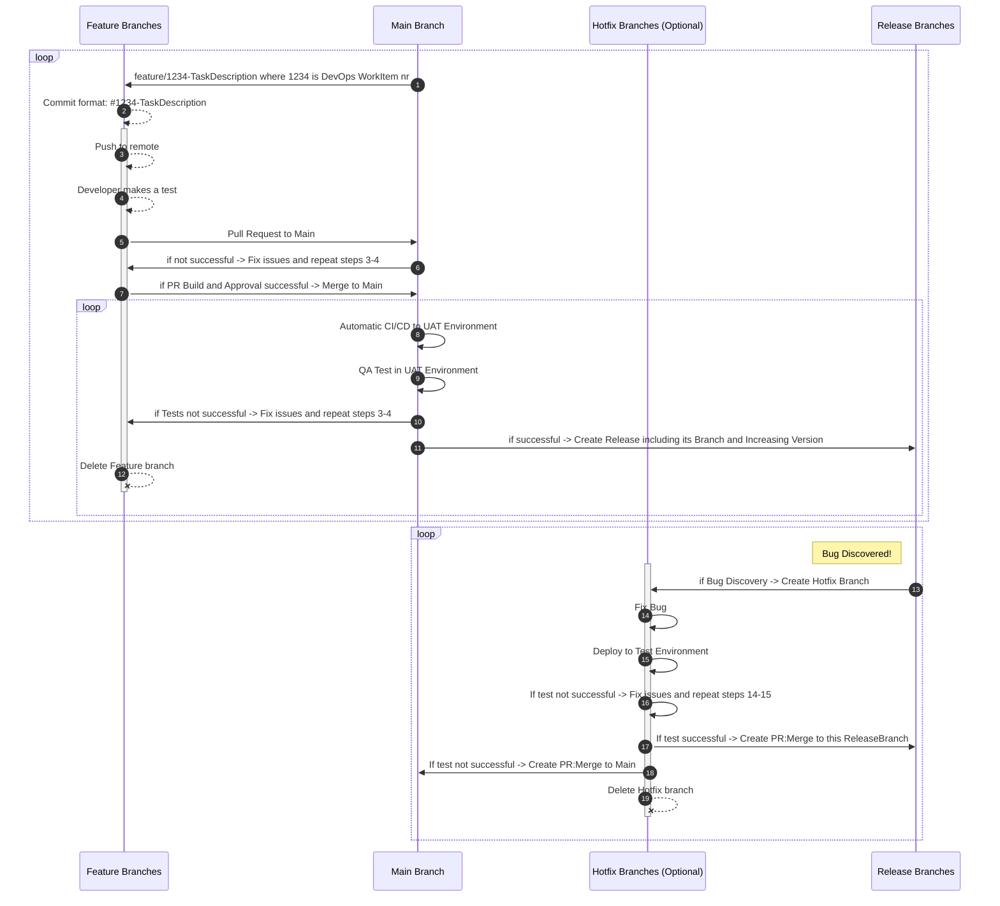

# 1. AL-Go-Git Flow

## 1.1. Branching Strategy

In Git Flow, a well-defined branching strategy helps manage the development process efficiently. The key branches in Git Flow are:

- **Main Branch:** Represents the latest code.
- **Feature Branches:** Created for developing new features.
- **Release Branches:** Used to prepare for a new release.
- **Hotfix Branches:** Created to fix critical issues in the released code.

#

## 1.2. Flow Steps

1. **Create Feature Branch:**
   - Create a feature branch from `main` with a name like `feature/1234-TaskDescription`, where 1234 is the DevOps WorkItem number.

2. **Feature Development:**
   - Commit changes with a format like `#1234-TaskDescription` indicating the related DevOps WorkItem.
   - Push commits to the remote repository.
   - Conduct developer testing.

3. **Pull Request to Main:**
   - Initiate a pull request from the feature branch to `main`.

4. **Pull Request Build and Approval:**
   - Trigger a build for the pull request.
   - Seek necessary approvals.
     - [ ] If PR build succeeds and Approved, proceed to step 5.
     - [ ] If PR build not succeeded or PR not approved, fix issues in the feature branch and repeat steps 3-4.

5. **Merge to Main:**
   - Merge the feature branch into `main`.

6. **CI/CD to UAT Environment:**
   - Automatically trigger CI/CD to deploy changes from `main` to the UAT Environment.

7. **QA Test in UAT:**
   - Conduct QA testing in the UAT Environment.
     - [ ] If testing is successful, proceed to step 8.
     - [ ] If issues are found, go back to the feature branch, fix, and repeat steps 3-6.

8. **Create Release Branch:**
   - Create a release branch from `main`.
   - Increment the version for the release.

9. **Publish to AppSource:**
   - Publish the release to AppSource.

10. **Delete Feature Branch:**
    - After successful merging and release, delete the feature branch.

11. **Bug Discovery and Hotfix:**
    - If a bug is discovered post-release, create a hotfix branch from `release/thisrelease`.
    - Fix the bug, deploy to a test environment, and merge changes back to the appropriate branches (`release` and `main`).

