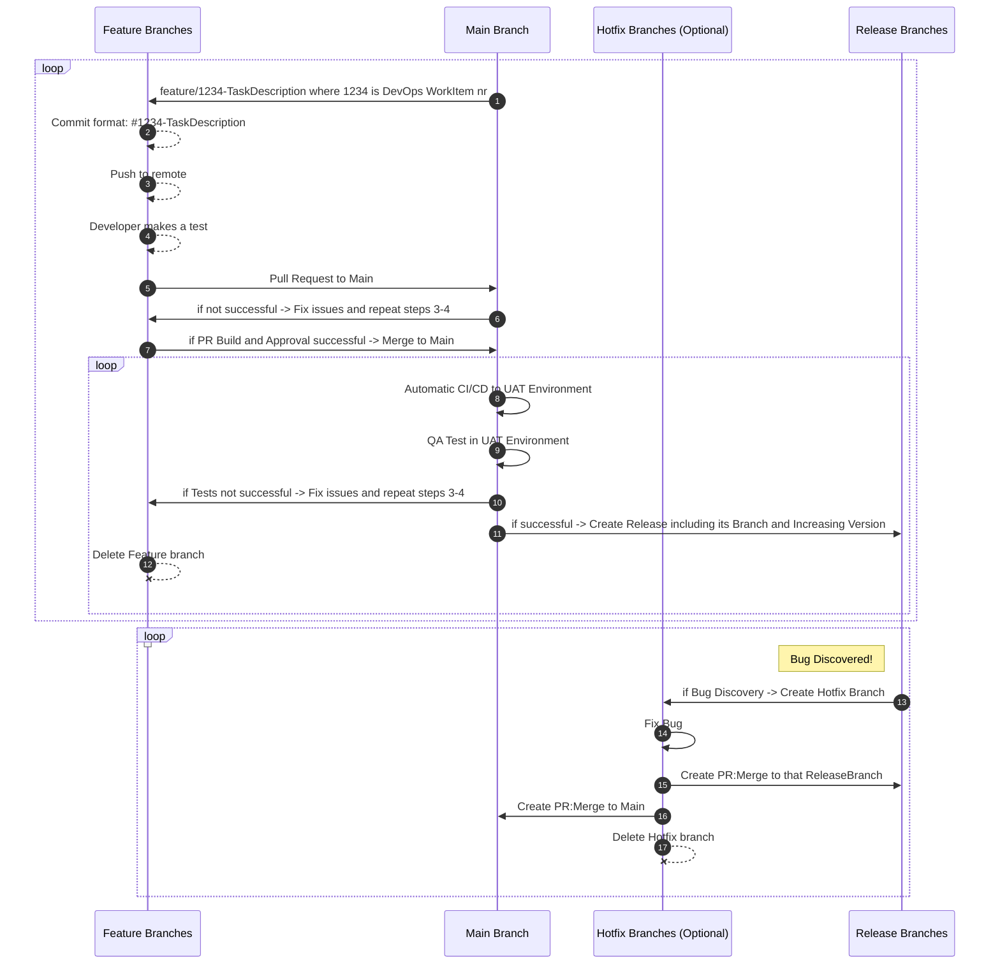

# Table of Contents

- 1. [AL-Go-Git Flow](#1-git-flow)
   - 1.1. [Branching Strategy](#11-branching-strategy)
   - 1.2. [Flow Steps](#12-flow-steps)
   - 1.3. [Environments](https://github.com/eh-ciellos/template/blob/e01ee857b4a34d8378db43f87660ba206064096c/ENVIRONMENTS.md)
      - 1.3.1. [Development Environment](https://businesscentral.dynamics.com/xxxxxxxx-xxxx-xxxx-xxxx-xxxxxxxxxxxx/DEV)
      - 1.3.2. [Test Environment](https://businesscentral.dynamics.com/xxxxxxxx-xxxx-xxxx-xxxx-xxxxxxxxxxxx/TEST)
      - 1.3.3. [UAT Environment](https://businesscentral.dynamics.com/xxxxxxxx-xxxx-xxxx-xxxx-xxxxxxxxxxxx/UAT)
      - 1.3.4. [Production Environment](https://businesscentral.dynamics.com/xxxxxxxx-xxxx-xxxx-xxxx-xxxxxxxxxxxx/PROD)

- 2. [Prerequisites for your local physical working station](https://github.com/eh-ciellos/template/blob/85ee1c9baa27c869389fd546746b495ea9d68f85/DeveloperLocalSetup.md)
   - 2.1. [Prerequisites for Docker on Windows](https://github.com/eh-ciellos/template/blob/main/DeveloperLocalSetup.md#21-prerequisites-for-docker-on-windows)
   - 2.2. [Install the required Windows Features for Docker](https://github.com/eh-ciellos/template/blob/main/DeveloperLocalSetup.md#22-install-the-required-windows-features-for-docker)
   -  2.3. [Install Docker as in the below guide](https://github.com/eh-ciellos/template/blob/main/DeveloperLocalSetup.md#23-install-docker-as-in-the-below-guide)
   -  2.4. [Clone your repo from VSCode as below](https://github.com/eh-ciellos/template/blob/main/DeveloperLocalSetup.md#24-clone-your-repo-from-vscode-as-below)

#

# 1. AL-Go-Git Flow

## 1.1. Branching Strategy

In Git Flow, a well-defined branching strategy helps manage the development process efficiently. The key branches in Git Flow are:

- **Main Branch:** Represents the latest code.
- **Feature Branches:** Created for developing new features.
- **Release Branches:** Used to prepare for a new release.
- **Hotfix Branches:** Created to fix critical issues in the released code.

## 1.2. Flow Steps

1. **Create Feature Branch:**
   - Create a feature branch from `main` where all development takes place.

2. **Deploy to Test Environment:**
   - Deploy the `.app` from the feature branch to the Test Environment for development testing.

3. **Pull Request to Main:**
   - Create a pull request from the feature branch to `main`.

4. **Pull Request Build and Approval:**
   - Trigger a build for the pull request.
   - Seek necessary approvals.
   
   - [ ] If approved, proceed to step 5.
   - [ ] If not approved, go back to the feature branch, fix issues, and repeat steps 3-4.

5. **Merge to Main:**
   - Merge the feature branch into `main`.

6. **CI/CD to UAT Environment:**
   - Set up Continuous Integration/Continuous Deployment (CI/CD) from `main` to deploy to the UAT Environment.

7. **Test in UAT:**
   - Perform testing in the UAT Environment.

   - [ ] If testing is successful, proceed to step 8.
   - [ ] If issues are found, go back to the feature branch, fix, and repeat steps 3-6.

8. **Create Release Branch:**
   - Create a release branch from `main`.
   - Increase the version for the release.

9. **Publish to AppSource:**
   - Publish the release to AppSource.

10. **Delete Feature Branch:**
    - Once the feature is successfully merged and released, delete the feature branch.

11. **Bug Discovery:**
    - If a bug is discovered, create a hotfix branch from `main`.

Feel free to customize the text or add any specific details as needed for your workflow.
