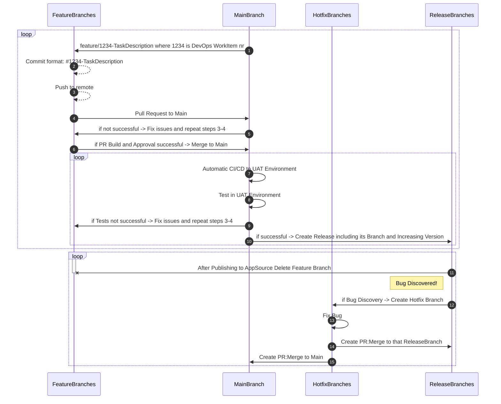

# Table of Contents

- 1. [AL-Go-Git Flow](#1-git-flow)
   - 1.1. [Branching Strategy](#11-branching-strategy)
   - 1.2. [Flow Steps](#12-flow-steps)
   - 1.3. [Environments](#13-environments)
      - 1.3.1. [Development Environment](#131-development-environment)
      - 1.3.2. [Test Environment](#132-test-environment)
      - 1.3.3. [UAT Environment](#133-uat-environment)
      - 1.3.4. [Production Environment](#134-production-environment)

- 2. [Prerequisites for Docker on Windows](#2-prerequisites-for-docker-on-windows)
   - 2.1. [Install the required Windows Features for Docker](#21-install-the-required-windows-features-for-docker)
   -  2.2. [Install Docker as in the below guide](#22-install-docker-as-in-the-below-guide)
   -  2.3. [Clone your repo from VSCode as below](#23-clone-your-repo-from-vscode-as-below)

#

# 1. AL-Go-Git Flow

## 1.1. Branching Strategy

In Git Flow, a well-defined branching strategy helps manage the development process efficiently. The key branches in Git Flow are:

- **Main Branch:** Represents the latest code.
- **Feature Branches:** Created for developing new features.
- **Release Branches:** Used to prepare for a new release.
- **Hotfix Branches:** Created to fix critical issues in the released code.




## 1.2. Flow Steps

1. **Create Feature Branch:**
   - Create a feature branch from `main` where all development takes place.

2. **Deploy to Test Environment:**
   - Deploy the `.app` from the feature branch to the Test Environment for development testing.

3. **Pull Request to Main:**
   - Create a pull request from the feature branch to `main`.

4. **Pull Request Build and Approval:**
   - Trigger a build for the pull request.
   - Seek necessary approvals.
   
   - [ ] If approved, proceed to step 5.
   - [ ] If not approved, go back to the feature branch, fix issues, and repeat steps 3-4.

5. **Merge to Main:**
   - Merge the feature branch into `main`.

6. **CI/CD to UAT Environment:**
   - Set up Continuous Integration/Continuous Deployment (CI/CD) from `main` to deploy to the UAT Environment.

7. **Test in UAT:**
   - Perform testing in the UAT Environment.

   - [ ] If testing is successful, proceed to step 8.
   - [ ] If issues are found, go back to the feature branch, fix, and repeat steps 3-6.

8. **Create Release Branch:**
   - Create a release branch from `main`.
   - Increase the version for the release.

9. **Publish to AppSource:**
   - Publish the release to AppSource.

10. **Delete Feature Branch:**
    - Once the feature is successfully merged and released, delete the feature branch.

11. **Bug Discovery:**
    - If a bug is discovered, create a hotfix branch from `main`.

Feel free to customize the text or add any specific details as needed for your workflow.


# 2. Prerequisites for Docker on Windows

Before you can use Docker on Windows, you need to ensure that your system meets certain prerequisites:

- **WSL** (Windows Subsystem for Linux) version 1.1.3.0 or above.
- **Windows 11** 64-bit: Home or Pro version 21H2 or higher, or Enterprise or Education version 21H2 or higher.
- **Windows 10** 64-bit: Home or Pro 21H2 (build 19044) or higher, or Enterprise or Education 21H2 (build 19044) or higher.
- Enable the **WSL 2** feature on Windows. For detailed instructions, refer to the [Microsoft documentation](https://docs.microsoft.com/en-us/windows/wsl/install).
- Hardware prerequisites for running WSL 2 on Windows 10 or Windows 11:
  - 64-bit processor with Second Level Address Translation (SLAT)
  - 4GB system RAM
  - BIOS-level hardware virtualization support must be enabled in the BIOS settings. For more information, see [Virtualization](https://docs.microsoft.com/en-us/virtualization/hyper-v-on-windows/quick-start/enable-hyper-v).

The following PowerShell code should be executed line by line (F8) but can also be executed as a block (F5).

## 2.1. Install the required Windows Features for Docker

```powershell
#Install the required Windows Features for Docker
Enable-WindowsOptionalFeature -Online -FeatureName $("Microsoft-Hyper-V", "Containers") -All

#Install Chocolatey
Set-ExecutionPolicy Bypass -Scope Process -Force
[System.Net.ServicePointManager]::SecurityProtocol = [System.Net.ServicePointManager]::SecurityProtocol -bor 3072
Invoke-Expression ((New-Object System.Net.WebClient).DownloadString('https://chocolatey.org/install.ps1'))
#Set Chocolatey Safe Switch
choco feature enable -n allowGlobalConfirmation

#Use Choco
#Install Git
choco install -y -n allowGlobalConfirmation git.install --force
#Install VSCode
choco install vscode.install --force
#Install VSCode Extensions
$vsCodeExec = ($Env:PROGRAMFILES) + "\Microsoft VS Code\bin\code.cmd"
$extensions = @(
"GitHub.vscode-pull-request-github", # GitHub Pull Request
"waldo.al-extension-pack" # Waldo AL Extension Pack
) | SORT
$extensions | ForEach-Object {
Invoke-Expression "& '$vsCodeExec' --install-extension $_ --force"
}
```
## 2.2. Install Docker as in the below guide
[Install Docker Desktop - Windows](https://docs.docker.com/desktop/install/windows-install/)
## 2.3. Clone your repo from VSCode as below:

Open a new VSCode window and clone the repository locally. (You can also use the command line to clone the repository.)

Or you can do it via CTRL+Shift+P and type Git: Clone

Paste the repository URL and hit ENTER

Create a new folder which will be your local repo and select it

This will start the cloning

Click Open on the new pop-up window

And you have to trust the authors to continue working on it

Now you can see the files in the repo
Execute .AL-Go\localDevEnv.ps1 as below to create your 1st BC container

You will be asked to enter the name of the container. Enter a name and hit ENTER
This container can be used to download symbols/publish your extension(Test your code before commiting to remote repo)
You can also update the launch.json to include a SaaS sandbox environment
Check this Microsoft documentation on how to create it
https://learn.microsoft.com/en-us/dynamics365/business-central/dev-itpro/developer/devenv-json-launch-file

When you need to add a change to your code, it is suggested to create a new branch and commit your changes there. The example below is just adding records to the .gitignore just to give the idea:


